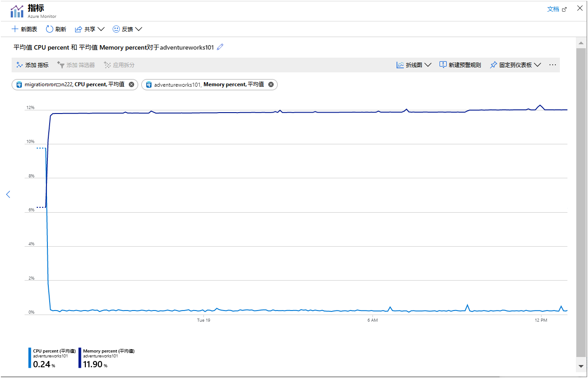
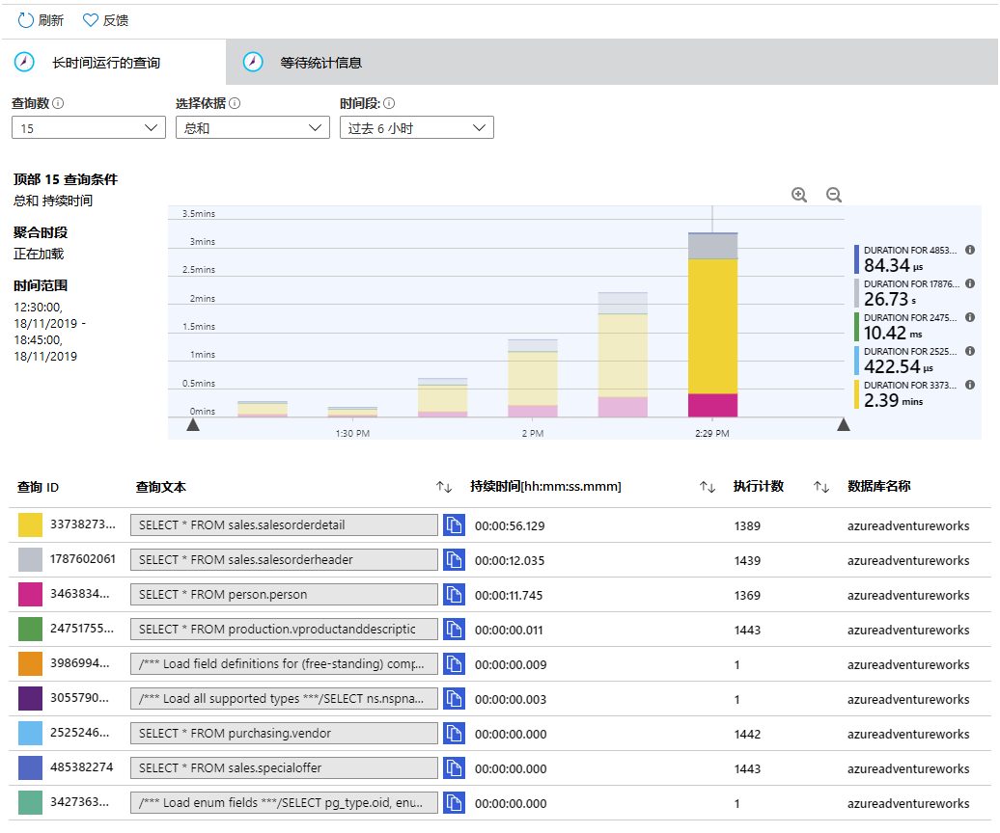
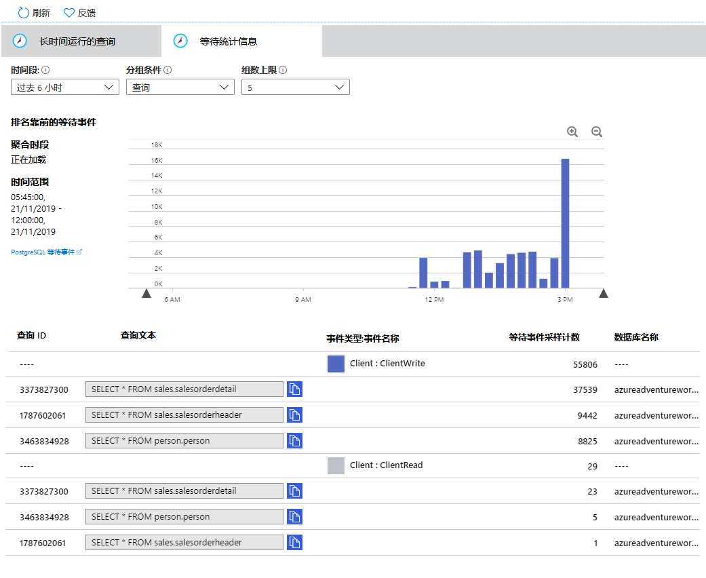
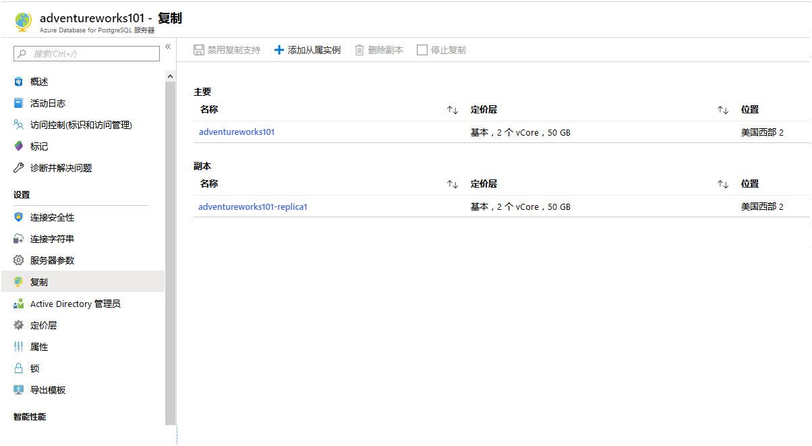
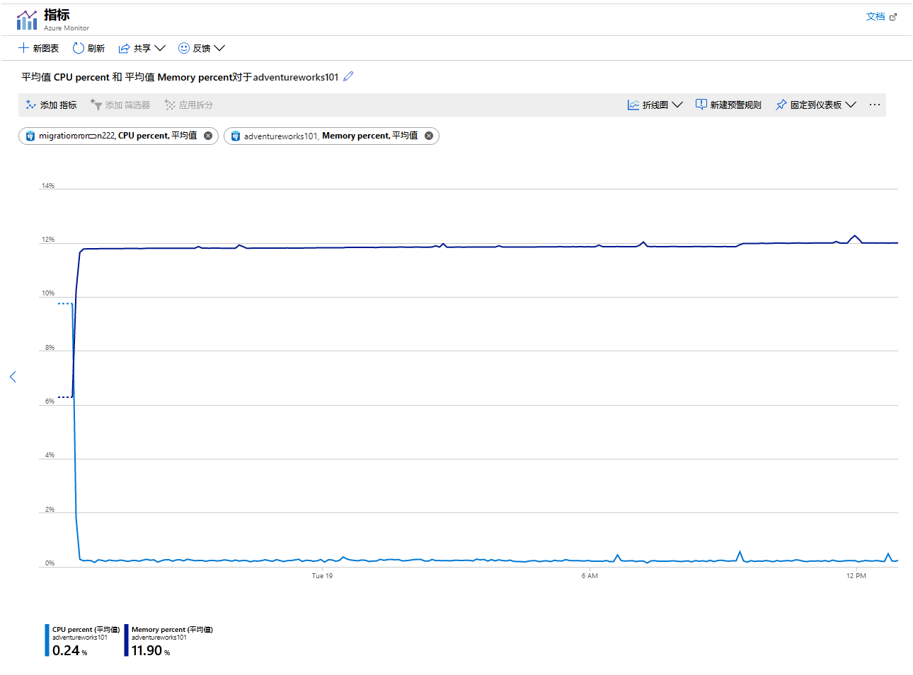

---
lab:
    title: '监视和调整迁移的数据库'
    module: '模块 4：保护监视和调整'
---

# 实验室：监视和调整迁移的数据库

## 概述

在本实验室中，你将使用在本模块中学习到的信息来监视和调整他们先前迁移的数据库。你将运行一个示例应用程序，此应用程序使数据库承受繁重的工作负荷，并使用 Azure 中可用的指标监视结果。你将使用查询存储来检查查询的性能。然后，你将配置只读副本，并将某些客户端的读取处理卸载到该副本。然后，你将检查此更改如何影响性能。

## 学习目标

完成本实验室后，你将能够：

1. 使用 Azure 指标来监视性能。
2. 使用查询存储检查查询的性能。
3. 卸载某些用户的读取操作以使用只读副本。
4. 再次监视性能并评估结果。

## 场景

你是 AdventureWorks 组织的数据库开发人员。十多年来，AdventureWorks 一直将自行车和自行车零件直接销售给最终用户和分销商。他们的系统将信息存储在你先前已迁移到 Azure Database for PostgreSQL 的数据库中。

执行之后，你要确保系统运行良好。你决定使用可用的 Azure 工具来监视服务器。为了降低争用和延迟引起响应时间变慢的可能性，你决定执行读取复制。你需要监视结果系统，并将结果与单一服务器体系结构进行比较。

## 设置

本实验室假定你已完成模块 3 的实验室；它使用 Azure Database for PostgreSQL 服务器和该实验室创建的数据库。如果你尚未完成该实验室，请执行以下设置步骤。如果你有一个运作正常的 Azure Database for PostgreSQL 服务器，并且已成功将 AdventureWorks 数据库迁移到该服务器，请直接进行练习 1 的设置。

1. 登录到在教室环境中运行的 **LON-DEV-01** 虚拟机。用户名是“**azureuser**”，密码为“**Pa55w.rd**”。

2. 使用浏览器登录至 Azure 门户。

3. 打开“Azure Cloud Shell”窗口。确保你正在运行 **Bash** shell。

4. 如果以前未执行此操作，请在 Cloud Shell 中，克隆包含脚本和示例数据库的存储库。

    ```bash
    git clone https://github.com/MicrosoftLearning/DP-070-Migrate-Open-Source-Workloads-to-Azure ~/workshop
    ```

5. 移动到“*workshop/migration_samples/setup/postgresql*”文件夹。

    ```bash
    cd ~/workshop/migration_samples/setup/postgresql
    ```

6. 执行以下命令。将“*[nnn]*”替换成一个数字，确保该脚本创建的 Azure Database for PostgreSQL 服务器具有唯一的名称。在指定为脚本的第二个参数的 Azure 资源组中创建服务器。如果资源组尚不存在，则会创建该资源组。也可以选择将资源组的位置指定为第三个参数。如果省略此参数，则此位置默认为“westus”：

    ```bash
    bash copy_adventureworks.sh adventureworks[nnn] [resource_group_name] [location]
    ```

7. 当提示你输入“*awadmin*”密码时，输入“**Pa55w.rdDemo**”。

8. 当提示你输入“*azureuser*”密码时，输入“**Pa55w.rd**”。

9. 等待脚本完成后再继续。此操作将需要 5 到 10 分钟，完成时显示消息“**设置完成**”。

## 练习 1：使用 Azure 指标来监视性能

在该练习中，你将执行以下任务：

1. 为 Azure Database for PostgreSQL 服务配置 Azure 指标。
2. 运行一个示例应用程序，该应用程序模拟查询数据库的多个用户。
3. 查看指标。

### 任务 1：为你的 Azure Database for PostgreSQL 服务配置 Azure 指标

1. 以“**azureuser**”用户的身份登录在教室环境运行的 **LON-DEV-01** 虚拟机，登录密码为“**Pa55w.rd**”。

2. 使用浏览器，登录至 Azure 门户。

3. 在 Azure 门户中，转到 Azure Database for PostgreSQL 服务页面。

4. 在“**监视**”下，单击“**指标**”。

5. 在图表页面上，添加以下指标：

    | 属性  | 值  |
    |---|---|
    | 资源 | adventureworks[nnn] |
    | 指标命名空间： | PostgreSQL 服务器标准指标 |
    | 指标 | 活动连接 |
    | 聚合 | 平均 |

    此指标显示每分钟与服务器建立的平均连接数。

6. 单击“**添加指标**”，并添加以下指标：

    | 属性  | 值  |
    |---|---|
    | 资源 | adventureworks[nnn] |
    | 指标命名空间： | PostgreSQL 服务器标准指标 |
    | 指标 | CPU 百分比 |
    | 聚合 | 平均 |

7. 单击“**添加指标**”，并添加以下指标：

    | 属性  | 值  |
    |---|---|
    | 资源 | adventureworks[nnn] |
    | 指标命名空间： | PostgreSQL 服务器标准指标 |
    | 指标 | 内存百分比 |
    | 聚合 | 平均 |

8. 单击“**添加指标**”，并添加以下指标：

    | 属性  | 值  |
    |---|---|
    | 资源 | adventureworks[nnn] |
    | 指标命名空间： | PostgreSQL 服务器标准指标 |
    | 指标 | IO 百分比 |
    | 聚合 | 平均 |

    最后三个指标显示了测试应用程序如何消耗资源。

9. 将图表的时间范围设置为 **最近 30 分钟**。

10. 单击“**固定到仪表板**”，然后单击“**固定到当前仪表板**”。

### 任务 2：运行一个示例应用程序，该应用程序模拟查询数据库的多个用户

1. 在 Azure 门户中，在 Azure Database for PostgreSQL 页面上的“**设置**”下，单击“**连接字符串**”。将 ADO.NET 连接字符串复制到剪贴板。

2. 切换到 Azure Cloud shell。如果以前未执行此操作，请克隆包含脚本和示例数据库的存储库。

    ```bash
    git clone https://github.com/MicrosoftLearning/DP-070-Migrate-Open-Source-Workloads-to-Azure ~/workshop
    ```

3. 移动到“*~/workshop/migration_samples/code/postgresql/AdventureWorksSoakTest*”文件夹。

    ```bash
    cd ~/workshop/migration_samples/code/postgresql/AdventureWorksSoakTest
    ```

4. 使用代码编辑器打开 App.config 文件：

    ```bash
    code App.config
    ```

5. 将“**ConectionString0**”的值替换成剪贴板中的连接字符串。将“**用户 ID**”更改成“**azureuser@adventureworks[nnn]**”，然后将“**密码**”设为“**Pa55w.rd**”。完成的文件看起来类似于以下示例：

    ```XML
    <?xml version="1.0" encoding="utf-8" ?>
    <configuration>
        <appSettings>
            <add key="ConnectionString0" value="Server=adventureworks101.postgres.database.azure.com;Database=azureadventureworks;Port=5432;User Id=azureuser@adventureworks101;Password=Pa55w.rd;Ssl Mode=Require;" />
            <add key="ConnectionString1" value="INSERT CONNECTION STRING HERE" />
            <add key="ConnectionString2" value="INSERT CONNECTION STRING HERE" />
            <add key="NumClients" value="100" />
            <add key="NumReplicas" value="1"/>
        </appSettings>
    </configuration>
    ```

    > [!注意]
    > 现在忽略 **ConnectionString1** 和 **ConnectionString2** 设置。你将稍后在实验室中更新这些项目。

6. 保存更改并关闭编辑器。

7. 在 Cloud Shell 提示符下，运行以下命令来构建和运行应用程序：

    ```bash
    dotnet run
    ```

    应用启动时，它将产生许多线程，每个线程模拟一个用户。线程执行循环，运行一系列查询。你将看到如下所示的消息开始出现：

    ```text
    Client 48 : SELECT * FROM purchasing.vendor
    Response time: 630 ms

    Client 48 : SELECT * FROM sales.specialoffer
    Response time: 702 ms

    Client 43 : SELECT * FROM purchasing.vendor
    Response time: 190 ms

    Client 57 : SELECT * FROM sales.salesorderdetail
    Client 68 : SELECT * FROM production.vproductanddescription
    Response time: 51960 ms

    Client 55 : SELECT * FROM production.vproductanddescription
    Response time: 160212 ms

    Client 59 : SELECT * FROM person.person
    Response time: 186026 ms

    Response time: 2191 ms

    Client 37 : SELECT * FROM person.person
    Response time: 168710 ms
    ```

    在执行下一个任务和练习 2 时，使应用继续运行。

### 任务 3：查看指标

1. 返回 Azure 门户。

1. 在左窗格中单击“**仪表板**”。

    你应该看到显示 Azure Database for PostgreSQL 服务指标的图表。

1. 单击图表以将其打开“**指标**”窗格。

1. 允许应用程序运行几分钟（时间越长越好）。随着时间的流逝，图表中的指标应类似于下图所示的模式：

    

    此图表突出了以下几点：

    - CPU 正在满负荷运行；利用率非常快地达到 100％。
    - 连接数缓慢增加。该示例应用程序旨在快速连续启动 101 个客户端，但是服务器一次只能处理几个连接。图表中每个“步骤”处添加的连接数量越来越少，“步骤”之间的时间越来越长。大约 45 分钟后，系统仅能建立 70 个客户端连接。
    - 随着时间的流逝，内存利用率不断增加。
    - IO 利用率接近零。客户端应用程序所需的所有数据当前都缓存在内存中。
  
    如果使应用程序运行足够长的时间，你将看到连接开始失败，出现如下图所示的错误消息。

    

1. 在 Cloud Shell 中，按 Enter 键以停止应用程序。

## 练习 2：使用查询存储检查查询的性能

在该练习中，你将执行以下任务：

1. 配置服务器以收集查询性能数据。
2. 使用查询存储检查应用程序运行的查询。
3. 使用查询存储检查发生的任何等待。

### 任务 1：  配置服务器以收集查询性能数据

1. 在 Azure 门户中，在 Azure Database for PostgreSQL 页面上的“**设置**”下，单击“**服务器参数**”。

1. 在“**服务器参数**”页面上，将以下参数设置为下表中指定的值。

    | 参数  | 值  |
    |---|---|
    | pg_qs.max_query_text_length | 6000 |
    | pg_qs.query_capture_mode | ALL |
    | pg_qs.replace_parameter_placeholders | ON |
    | pg_qs.retention_period_in_days | 7 |
    | pg_qs.track_utility | ON |
    | pg_stat_statements.track | ALL |
    | pgms_wait_sampling.history_period | 100 |
    | pgms_wait_sampling.query_capture_mode | ALL |

1. 单击“**保存**”。

### 任务 2：  使用查询存储检查应用程序运行的查询

1. 返回到 Cloud Shell，然后重新启动示例应用程序：

    ```bash
    dotnet run
    ```

    在继续之前，请允许应用运行 5 分钟左右。

1. 使应用程序继续运行并切换到 Azure 门户

1. 在 Azure Database for PostgreSQL 服务器页面上，在“**智能性能**”下单击“**查询性能见解**”。

1. 在“**查询性能见解**”页面上的“**长期查询**”选项卡上，将“**查询数量**”设为 10，将“**选择依据**”设为“**平均**”，然后将“**时间段**”设为“**最近 6 小时**”。

1. 在图表上方，多次单击“**放大**”（带有“+”号的放大镜图标），以放大最新数据。

    你将看到类似于以下所示的图表，具体取决于应用程序运行了多长时间。查询存储每 15 分钟汇总一次查询的统计信息，因此每个条形图显示每 15 分钟内每个查询消耗的相对时间：

    

1. 将鼠标依次悬停在每个栏上，以查看该时间段内查询的统计信息。系统花费最长时间执行的三个查询是：

    ```SQL
    SELECT * FROM sales.salesorderdetail
    SELECT * FROM sales.salesorderheader
    SELECT * FROM person.person
    ```

    此信息对于监视系统的管理员很有用。深入了解用户和应用程序正在运行的查询，就能够了解正在执行的工作负荷，并可向应用程序开发人员提出有关如何改进其代码的建议。例如，应用程序是否真的有必要检索 **sales.salesorderdetail** 表中的全部 121,000 多行？

### 任务 3：使用查询存储检查发生的任何等待

1. 单击“**等待统计**”选项卡。

1. 将“**时间段**”设为“**最近 6 小时**”，将“**分组依据**”设为“**事件**”，并将“**组数上限**”设为 **5**。

    与“**长期查询**”选项卡一样，则每 15 分钟汇总一次数据。图表下方的表显示，系统已成为两种等待事件的主体：

    - **客户端：ClientWrite**。当服务器将数据（结果）写回到客户端时，将发生此等待事件。这 **不** 代表在写入数据库时发生的等待。
    - **客户端：ClientRead**。当服务器正在等待从客户端读取数据（查询请求或其他命令）时，将发生此等待事件。它与从数据库读取所花费的时间 **不** 相关。
  
    
  
    > [!注意]
    > 对数据库的读写操作由“**IO**”事件指示，而不是“**客户端**”事件。该示例应用程序不会引起任何 IO 等待，因为它需要的所有数据在第一次读取后都会缓存在内存中。如果指标表明内存容量不足，你可能会看到 IO 等待事件开始发生。

1. 返回到 Cloud Shell，然后按 Enter 停止示例应用程序。

## 练习 3：卸载某些用户的读取操作以使用只读副本

在该练习中，你将执行以下任务：

1. 将副本添加到 Azure Database for PostgreSQL 服务。
2. 配置副本以启用客户端访问。
3. 重新启动每个服务器。

### 任务 1：将副本添加到 Azure Database for PostgreSQL 服务

1. 在 Azure 门户中，在 Azure Database for PostgreSQL 页面上的“**设置**”下，单击“**复制**”。

1. 在“**复制**”页面上，单击“**+ 添加副本**”。

1. 在“**PostgreSQL 服务器**”页面的“**服务器名**”方框中，键入“**adventureworks[nnn]-replica1**”，然后单击“**确定**”。

1. 创建第一个副本后（这需要几分钟），重复上一步并添加另一个名为“**adventureworks[nnn]-replica2**”的副本。

1. 等待直至两个副本的状态从“**部署**”更改为“**可用**”后再继续。

    

### 任务 2：配置副本以启用客户端访问

1. 单击“**adventureworks[nnn]-replica1**”副本的名称。你将转到该副本的 Azure Database for PostgreSQL 页面。

1. 在“**设置**”下，单击“**连接安全性**”。

1. 在“**连接安全性**”页面，将“**允许访问 Azure 服务**”设为“**开**”，然后单击“**保存**”。此设置使你使用 Cloud Shell 运行的应用程序能够访问服务器。

1. 保存设置后，重复前面的步骤并允许 Azure 服务访问“**adventureworks[nnn]-replica2**”副本。

### 任务 3：重新启动每台服务器

> [!注意]
> 配置复制不需要你重新启动服务器。该任务的目的是清除每个服务器上的内存和任何无关的连接，以便在再次运行该应用程序时收集的指标已得到*清理*。

1. 转到 **adventureworks*[nnn]** 服务器的页面。

1. 在“**概述**”页面，单击“**重启**”。

1. 在“**重启服务器**”对话框中，单击“**是**”。

1. 等待服务器重启后再继续。

1. 按照相同的步骤，重新启动 **adventureworks*[nnn]-replica1** 和 **adventureworks*[nnn]-replica2** 服务器。

## 练习 4：再次监视性能并评估结果

在该练习中，你将执行以下任务：

1. 重新配置示例应用程序以使用副本。
2. 监控应用程序并观察性能指标之间的差异。

### 任务 1：重新配置示例应用程序以使用副本

1. 在 Cloud Shell 中，编辑 App.config 文件。

2. 为“**ConnectionString1**”和“**ConnectionString2**”设置添加连接字符串。这些值应与“**ConnectionString0**”的相同，但带有文字“**adventureworks[nnn]**”被替换为“**服务器**”和“**用户 ID**”元素中的“**adventureworks[nnn]-replica1**”和“**adventureworks[nnn]-replica2**”。

3. 将“**NumReplicas**”设置为 **3**。

    App.config 文件现在应该类似于这样：

    ```XML<?xml version="1.0" encoding="utf-8" ?>
    <configuration>
        <appSettings>
            <add key="ConnectionString0" value="Server=adventureworks101.postgres.database.azure.com;Database=azureadventureworks;Port=5432;User Id=azureuser@adventureworks101;Password=Pa55w.rd;Ssl Mode=Require;" />
            <add key="ConnectionString1" value="Server=adventureworks101-replica1.postgres.database.azure.com;Database=azureadventureworks;Port=5432;User Id=azureuser@adventureworks101-replica1;Password=Pa55w.rd;Ssl Mode=Require;" />
            <add key="ConnectionString2" value="Server=adventureworks101-replica2.postgres.database.azure.com;Database=azureadventureworks;Port=5432;User Id=azureuser@adventureworks101-replica2;Password=Pa55w.rd;Ssl Mode=Require;" />
            <add key="NumClients" value="100" />
            <add key="NumReplicas" value="3"/>
        </appSettings>
    </configuration>
    ```

4. 保存文件并关闭编辑器。

5. 重新启动应用程序运行：

    ```bash
    dotnet run
    ```

    应用程序将和之前一样运行。但是，这次，请求分布在三个服务器之间。

6. 允许该应用运行几分钟，然后再继续。

### 任务 2：监控应用程序并观察性能指标之间的差异

1. 使应用程序继续运行并返回到 Azure 门户。

2. 在左窗格中单击“**仪表板**”。

3. 单击图表以将其打开“**指标**”窗格。

    请记住，此图表显示 adventureworks*[nnn]* 服务器的指标，而不是副本。每个副本的负载应大致相同。

    示例图表说明了从启动到 30 分钟内为应用程序收集的指标。该图表显示 CPU 利用率仍然很高，但内存利用率较低。此外，大约 25 分钟后，系统建立了 30 多个连接的连接。与以前的配置（45 分钟后支持 70 个连接）相比，这似乎不太有利。但是，工作负荷现在分散在三台服务器上，它们都在同一级别上执行，并且已经建立了全部 101 个连接。此外，该系统能够继续运行，且不会报告任何连接失败情况。

    

    你可以通过扩展到具有更多 CPU 内核的更高定价层来解决 CPU 利用率问题。本实验室中使用的示例系统使用具有 2 个核心的“**基本**”定价层运行。更改为“**常规用途**”定价层将为你提供多达 64 个内核。

4. 返回到 Cloud Shell，然后按 Enter 停止应用程序。

现在，你已经了解了如何使用 Azure 门户中可用的工具监视服务器活动。你还学习了如何配置复制，并了解了创建只读副本如何在读取密集型方案中分配工作负荷。
